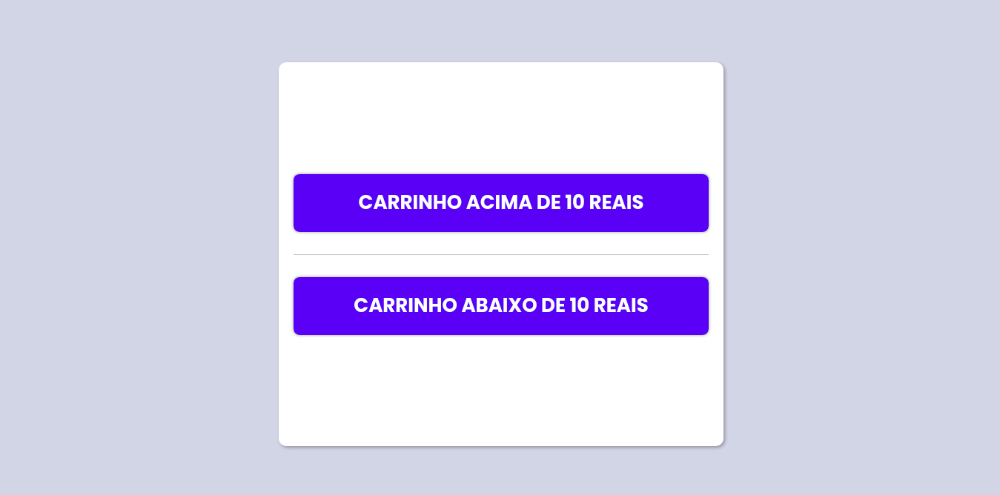
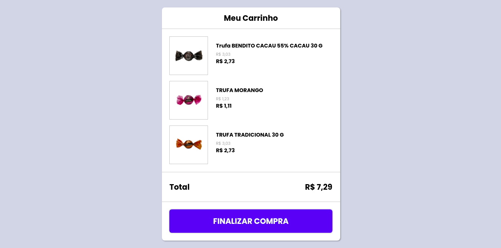
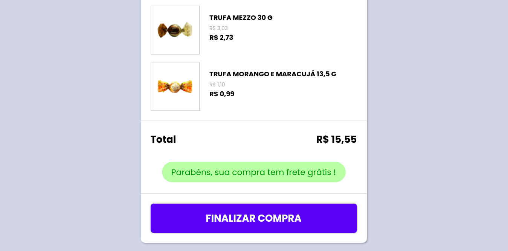
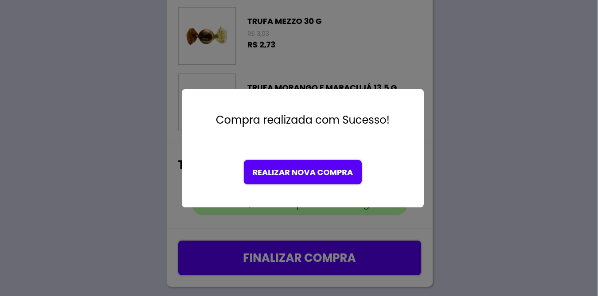

<h1 align="center">Codeby Challenge</h1>
<div align="center">


</div>


## Install

You need the [Node.js](https://nodejs.org/en/download/) and [Yarn](https://classic.yarnpkg.com/en/docs/install/) to run this project, this example was created with `Node.js v14.16.0` and `Yarn v1.22.5`.

### Development Mode

```bash
yarn install
yarn dev
```

### Production Mode

```bash
yarn install
yarn build
yarn start
```

## Screenshots

### Home
<div align="center">
  
  <br /> <br />
</div>

### Cart
<div align="center">
  
    <br /> <br />
</div>

### Cart Free Shipping
<div align="center">
   
     <br /> <br />
</div>

### Cart Modal
<div align="center">
   
     <br /> <br />
</div>

## License

The [MIT License]() (MIT)

Copyright© 2020
